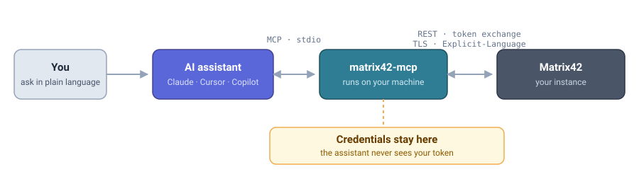
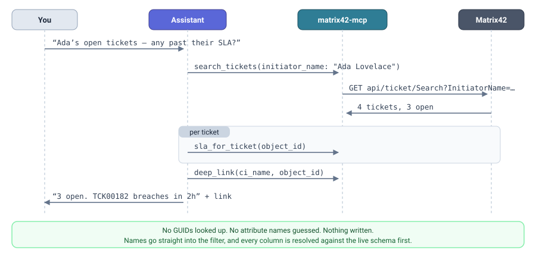
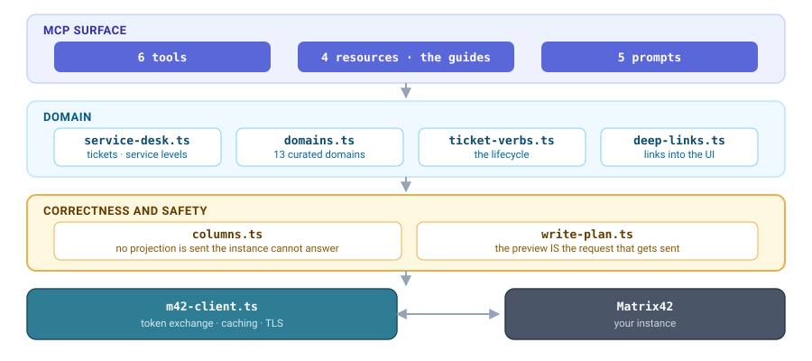

# Matrix42 MCP Server

[](https://github.com/sus-tech-gmbh/matrix42-mcp/actions/workflows/ci.yml)
[](https://www.npmjs.com/package/matrix42-mcp)
[](https://nodejs.org)
[](LICENSE)
[](https://modelcontextprotocol.io)
[](CONTRIBUTING.md)

**Give your AI assistant a safe, read-only-by-default window into Matrix42.**

A [Model Context Protocol](https://modelcontextprotocol.io) server that lets an assistant explore a
Matrix42 instance the way an experienced consultant would: find the right web service, read the real
data model, query records with valid filters, search the service desk, and — only if you switch it
on — act on tickets.

The server holds the credentials and talks to Matrix42 on the assistant's behalf: it performs the
API-token exchange, sets the `Explicit-Language` header, and handles TLS. **The assistant never sees
your credentials.**

<p align="center">
  
</p>

```bash
npx matrix42-mcp --help
```

> [!IMPORTANT]
> **This is an independent community project.** It is **not affiliated with, endorsed by, sponsored
> by, or supported by Matrix42 AG.** "Matrix42" is a trademark of its respective owner and is used
> here only to describe what this software interoperates with. Support comes from the community via
> [GitHub issues](https://github.com/sus-tech-gmbh/matrix42-mcp/issues) — **do not contact Matrix42
> support about this project**, and do not expect a service-level agreement of any kind. It is
> provided "as is" under the [MIT licence](LICENSE).

> [!NOTE]
> **Status: early release.** The server is **read-only by default** — write tools are not even listed
> unless you set `M42_ALLOW_WRITES=1`.

### Highlights

- **Read-only by default.** Write tools are absent from the tool list unless explicitly enabled.
- **Never guesses.** Every column is resolved against your instance's live schema before a query
  runs, so a field your instance does not have is reported — not sent and turned into an opaque 500.
- **Teaches, then acts.** Four written guides ship with the server as MCP resources, covering the
  data model, the schema, the ASQL filter language and the REST conventions.
- **Preview before you write.** Every write returns the exact request it *would* send until you
  pass `confirm`. The preview is the same plan object that gets executed, so it cannot drift.
- **Safe defaults where it counts.** Notification e-mails are off, journal entries are internal, and
  cascading closes are opt-in.
- **No Matrix42 code or content.** Every guide is original prose that links to the official docs
  rather than reproducing them.

### Contents

- [Why](#why) · [Tools](#tools) · [Requirements](#requirements) · [Configuration](#configuration)
- [Client setup](#client-setup) — [Claude Code](#claude-code), [Claude Desktop](#claude-desktop), [Cursor](#cursor), [VS Code](#vs-code-github-copilot)
- [Writing data](#writing-data) · [Security notes](#security-notes) · [Development](#development) · [Contributing](#contributing)

---

## Why

Matrix42's API surface is large (a typical instance exposes ~190 web services and ~1,100 operations),
plus a data model of ~800 data definitions and ~240 configuration items, and an assistant has no way
to know what exists. Point it at this server and it can search for the
right endpoint, read the exact contract, and then write correct integration code — instead of
guessing at URLs, auth, and headers.

---

## What it can do

| | |
| --- | --- |
| **Discover the API** | ~1,100 operations with full request and return contracts, and whether each is update-safe |
| **Understand the model** | 785 data definitions, 237 configuration items, pickup values, relations and cardinality |
| **Read records** | ASQL queries with paging, saved views, journal, attachments, and links into the web interface |
| **Work the service desk** | Search seven ticket kinds by name, service levels, thirteen curated domains, or search all of them at once |
| **Act on tickets** | Create, close, classify, take over, forward, pause, reopen, set deadlines, track time — each previewed first |

## Tools

| Tool | What it does |
| --- | --- |
| `server_info` | Reports which Matrix42 instance is connected and verifies the credentials work. Never returns credentials. |
| `webservice_discovery` | Discovers the REST API. See the actions below. |
| `schema_discovery` | Explores the data model: data definitions, configuration items, attributes, relations, pickup values. |
| `data_query` | Reads records: ASQL queries, saved views, journal entries, attachments, plus an ASQL guide and validator. |
| `service_desk` | Searches tickets of any kind, answers service-level questions, and browses assets, contracts, catalog services, bookings, knowledge articles, approvals, imports and workflow instances. |
| `ticket_actions` | **Writes** — the ticket lifecycle: create, close, take over, forward, pause, reopen, set deadlines, track time, add journal entries. Only present when `M42_ALLOW_WRITES=1`. |

### What a conversation looks like

> **You:** Which open tickets is Ada Lovelace waiting on, and are any of them past their service level?

The assistant works it out without you naming a single id:

<p align="center">
  
</p>

Note what did **not** happen: no GUID lookups, no guessed attribute names, and nothing was written.

### `webservice_discovery` actions

| Action | Parameters | Returns |
| --- | --- | --- |
| `api_overview` | – | General Matrix42 API conventions: token exchange, `Explicit-Language`, Public vs Product API, common data surfaces. Useful before writing standalone integration code. |
| `list_operations` | `search?`, `service_id?`, `limit?` | Operations as `{id, name, method, path, service, documentation}`. `search` filters on name, documentation, and service name. Defaults to the first 200 matches; pass `limit: 0` for all. |
| `list_services` | – | Every web service with its route prefix and documentation. |
| `describe_operation` | `operation_id` | One operation's full contract: HTTP method, path, parameters with types, and return type. |

**Typical flow:** `api_overview` once → `list_operations` with a search term → `describe_operation`
on the one you want.

### `schema_discovery` actions

| Action | Parameters | Returns |
| --- | --- | --- |
| `schema_overview` | – | How the Matrix42 data model fits together: data definitions vs configuration items, fragments and multi-fragments, cardinality, pickups, and where to find the official docs. |
| `list_data_definitions` | `search?`, `include_pickups?`, `limit?` | Definitions as `{internalName, displayName, description, classType, isPickup, isCustom}`. Pickup classes are excluded unless asked for. |
| `list_configuration_items` | `search?`, `limit?` | Items with their main class and member definitions. |
| `describe_data_definition` | `name`, `include?` | Attributes with decoded datatypes and pickup cross-links. Relations are excluded by default (a central definition can have 150+) — pass `include: "relations"` or `"both"`. |
| `describe_configuration_item` | `name` | The definitions an object is composed of, each with its cardinality and a `isMultiFragment` flag. |
| `get_pickup_values` | `pickup_class` **or** `name`+`attribute` | The selectable `{value, label}` pairs — so a model filters on real values instead of guessing codes. |

**Typical flow:** `schema_overview` → `list_*` with a search term → `describe_*` → `get_pickup_values`
before filtering on any pickup attribute.

### `data_query` actions

| Action | Parameters | Returns |
| --- | --- | --- |
| `asql_guide` | – | The ASQL expression language used by `where` and `columns`: operators, dot chains, pickups, `T(...)` pivots, subqueries, `[Expression-ObjectID]`. |
| `validate_asql` | `class`, `expression` | Whether an expression is valid, with the exact error (e.g. *"does not contain attribute Nope"*). Cheaper than a failed query. |
| `query` | `class`, `columns?`, `where?`, `sort?`, `page_size?`, `page?` | Rows plus typed column metadata, with paging (`hasMore`). |
| `get_fragment` | `class`, `fragment_id` | One complete fragment. |
| `get_object` | `ci_name`, `object_id` | One whole object (all fragments of a configuration item). |
| `list_views` / `run_view` | `search?` / `view_id` | The instance's saved data queries — curated views that already carry a predefined filter. Prefer a matching view over hand-written ASQL. |
| `list_journal` | `object_id` | An object's comment/activity timeline. |
| `list_attachments` | `object_id` | The files attached to an object. |
| `deep_link` | `object_id`, `view_type?` | A URL into the Matrix42 web interface — preview, edit, create or run an action. Resolves the object's configuration item itself, so you only need the object id. |

**Typical flow:** `asql_guide` once → `schema_discovery` to find the class and its pickup values →
`validate_asql` → `query`. Always pass `sort` when paging; page boundaries are otherwise unstable.

Numeric enums are decoded for you (`Datatype: 2` → `"Int"`, `Cardinality: 3` → `"Optional (Multi)"`),
and customisations are flagged using the custom prefix the instance itself reports.

### `service_desk` actions

| Action | Parameters | Returns |
| --- | --- | --- |
| `data_model` | – | How Matrix42's modules map onto a handful of base classes — where tickets, assets, licenses, contracts, SLAs and catalog items actually live. Read it when you are unsure where something is. |
| `search_tickets` | `kind`, plus any of `ticket_number`, `subject`, `states`, `category_name`, `initiator_name`, `recipient_name`, `recipient_role_name`, `asset_id`, `service_id`, `only_mine`+`user_id` | Matching tickets. `kind` is one of `ticket`, `incident`, `problem`, `change`, `task`, `service_request`, `kb_article`. |
| `get_ticket` | `ticket_object_id` | One ticket's summary as the service desk sees it. |
| `sla_for_ticket` | `ticket_object_id` | The service level agreements that apply, as Matrix42 itself computes them. |
| `sla_times` | `ticket_object_id` | Reaction and solution time state. |
| `browse` | `domain`, `search?`, `where?`, `limit?` | Rows of one curated domain, plus the fields this instance does not have. |
| `find` | `search`, `domains?`, `limit?` | Searches **every** domain at once for a name — for when you do not know where something lives. Domains that fail (module not installed) are reported, not fatal. |

Ticket search filters by **name**, not id: `initiator_name: "Ada Lovelace"` and
`category_name: "Hardware"` work directly, with no GUID lookup first. Every kind shares the same
contract, so one call shape covers the whole service desk.

`browse` domains: `assets`, `stock_units`, `contracts`, `slas`, `catalog_services`, `bookings`,
`kb_articles`, `approvals`, `imports`, `import_runs`, `workflow_instances`, `workflow_definitions`,
`applications`. Workflows are **read-only** — this server lists definitions and instances but never
starts, suspends, resumes or cancels them.

**Columns are never guessed.** Before every `browse`, the server reads the definition's real
attribute list from the instance and keeps only the fields that exist, reporting the rest as
`unavailableFields`. A module you have not licensed therefore yields a shorter row, not a failed
call. The same rule is stated in the guides and the server instructions, so a connected model
follows it too.

All read tools are annotated `readOnlyHint: true`, so clients can distinguish them from anything that
would change data.

### Prompts

Reusable templates your client can offer (in Claude Desktop, the prompts menu). Each one encodes the
order of operations this server rewards, so a model does not have to rediscover it by failing:

| Prompt | For |
| --- | --- |
| `explore_instance` | Getting oriented in an unfamiliar instance |
| `build_query` | Turning a question into a validated ASQL query |
| `triage_ticket` | Working one ticket end to end, without changing anything |
| `safe_change` | Walking a write through preview → confirm |
| `find_endpoint` | Locating the right operation before writing integration code |

### Resources

The written guides are also published as MCP resources, so a client can read them without a tool
call and attach one to a conversation up front:

| URI | Contents |
| --- | --- |
| `matrix42://guide/data-model` | Matrix42 is one graph, not many modules |
| `matrix42://guide/schema` | Data definitions, configuration items, fragments, pickups |
| `matrix42://guide/asql` | The ASQL expression language |
| `matrix42://guide/api` | REST API conventions: auth, headers, Public vs Product API |

#### Links into the web interface

`data_query(action='deep_link')` builds a URL an assistant can hand you, in the format Matrix42
documents for deep linking:

```
https://your-instance/wm/app-ServiceDesk/?view-options={"type":"SPSActivityTypeTicket",
                                                        "viewType":"preview",
                                                        "objectId":"<object id>"}
```

`view_type` selects what opens: `preview` (default, read-only), `edit`, `new` for a creation form,
or `action` for a wizard. Only `new` works without an object id, and `action` additionally needs an
`action_id`. Nothing is ever changed by opening a link — even `edit` waits for a person to save.

**You only need the object id.** A base data definition is reused by many configuration items —
`SPSActivityClassBase` alone backs incidents, service requests and changes — so the server resolves
the real one for you rather than making you pick. Pass a wrong `ci_name` and it corrects it; pass a
fragment id and it refuses instead of handing you a link that opens nothing.

**Links target the web interface's own origin, not the API host you connected to.** Those are often
different: an instance reachable at an IP commonly serves its UUX under a real name, and the shell's
`config.json` says which. Loading the shell from the wrong origin leaves the app calling an origin
it was not served from, which fails after the page has already appeared to load. The server reads
that origin from the instance and reports it as `webInterface` alongside the link; `M42_UI_URL`
overrides it.

The same text is checked in under [`docs/`](docs/) so it is readable on GitHub without running
anything — start with **[Matrix42 is one graph, not many modules](docs/matrix42-data-model.md)**,
which explains why there is no "Licenses" or "SLAs" table and where those records actually live.
Those files are generated from the guide modules (`npm run docs`), and a test fails if they drift.

---

## Requirements

- **Node.js 22.19 or newer** (required by undici, the HTTP client)
- A Matrix42 instance and either an **API token** (recommended) or basic-auth credentials

### Creating an API token

In the Matrix42 **Administration** application, create an API token for the account the assistant
should act as. The server exchanges it for a short-lived access token automatically and re-exchanges
it before it expires.

> Basic auth is supported but discouraged: many instances accept the credentials yet still refuse API
> access with `403` because of role/audience restrictions.

---

## Configuration

All configuration is via environment variables.

| Variable | Required | Default | Description |
| --- | --- | --- | --- |
| `M42_HOST` | ✅ | – | Base URL of the instance, e.g. `https://matrix42.example.com` |
| `M42_API_TOKEN` | ✅¹ | – | API token; exchanged for an access token automatically |
| `M42_USERNAME` / `M42_PASSWORD` | ✅¹ | – | Basic-auth alternative to `M42_API_TOKEN` |
| `M42_LANGUAGE` | | `en-US` | Response language, sent as `Explicit-Language` |
| `M42_TOOLS` | | all | Comma-separated tool ids to expose |
| `M42_ALLOW_WRITES` | | `0` | Set to `1` to expose tools that modify data. Write tools are not registered at all unless this is set. |
| `M42_ALLOW_INSECURE_TLS` | | `0` | Set to `1` to skip TLS verification (self-signed dev instances only) |
| `M42_AUDIT_NOTE` | | `1` | Mark created tickets with an internal note saying they were raised through this server. Set to `0` to disable. |
| `M42_AGENT_LABEL` | | `Matrix42 MCP server` | How the assistant is named in that note |
| `M42_UI_URL` | | discovered | Origin of the web interface, for deep links. Discovered from the instance's web shell config when unset. |
| `M42_TIMEOUT_MS` | | `30000` | Per-request timeout |

¹ Provide **either** `M42_API_TOKEN` **or** both `M42_USERNAME` and `M42_PASSWORD`.

---

## Client setup

The server runs over **stdio**: your MCP client starts it. No install step is needed — `npx` fetches
it on demand.

### Claude Code

```bash
claude mcp add matrix42 \
  --env M42_HOST=https://matrix42.example.com \
  --env M42_API_TOKEN=your-api-token \
  -- npx -y matrix42-mcp
```

### Claude Desktop

`claude_desktop_config.json`
(macOS: `~/Library/Application Support/Claude/`, Windows: `%APPDATA%\Claude\`)

```json
{
  "mcpServers": {
    "matrix42": {
      "command": "npx",
      "args": ["-y", "matrix42-mcp"],
      "env": {
        "M42_HOST": "https://matrix42.example.com",
        "M42_API_TOKEN": "your-api-token"
      }
    }
  }
}
```

### Cursor

`~/.cursor/mcp.json` (global) or `.cursor/mcp.json` (per project)

```json
{
  "mcpServers": {
    "matrix42": {
      "command": "npx",
      "args": ["-y", "matrix42-mcp"],
      "env": {
        "M42_HOST": "https://matrix42.example.com",
        "M42_API_TOKEN": "your-api-token"
      }
    }
  }
}
```

### VS Code (GitHub Copilot)

`.vscode/mcp.json` — this shape prompts for the token instead of storing it in the file:

```json
{
  "inputs": [
    { "id": "m42-token", "type": "promptString", "description": "Matrix42 API token", "password": true }
  ],
  "servers": {
    "matrix42": {
      "type": "stdio",
      "command": "npx",
      "args": ["-y", "matrix42-mcp"],
      "env": {
        "M42_HOST": "https://matrix42.example.com",
        "M42_API_TOKEN": "${input:m42-token}"
      }
    }
  }
}
```

Other stdio-capable clients (Windsurf, Cline, Zed, …) use the same `command` / `args` / `env` shape.

---

## Verifying the connection

Ask the assistant to call `server_info`, or run the bundled smoke test against your instance:

```bash
git clone https://github.com/sus-tech-gmbh/M42-MCP.git
cd M42-MCP && npm install && npm run build

M42_HOST=https://matrix42.example.com \
M42_API_TOKEN=your-api-token \
node scripts/smoke.mjs
```

It connects as a real MCP client and exercises every tool.

You can also run the CLI directly:

```bash
npx matrix42-mcp --help    # usage and configuration
npx matrix42-mcp --tools   # available tool ids
```

---

## Writing data

Write tools are absent from the tool list unless `M42_ALLOW_WRITES=1`, so a default deployment
cannot modify anything even if a model asks it to. When enabled, `ticket_actions` offers:

| Action | Notes |
| --- | --- |
| `create_ticket` | Returns the new **object id**, which every other action takes directly. |
| `close_ticket` | Closes by object id, with an optional solution and closing reason. |
| `add_journal_entry` | Adds a comment to any object, with optional template `parameters`. |
| `classify_ticket` | Only suggests a type from text — changes nothing. |
| `take_over` / `accept` | Claims tickets. Needs `type_name`, the configuration item they belong to. |
| `forward` | Hands tickets to a `role_id` or `user_id`, optionally applying an OLA. |
| `pause` | Holds a ticket, optionally stopping the escalation clock (`not_escalate_while_paused`). |
| `reopen` | Reverses a close, with a reason. |
| `return_to_role` | Gives one ticket back to its responsible role. |
| `set_deadline` | Sets the date the ticket must be handled by. |
| `track_working_time` | Books effort, optionally typed (`investigation`, `resolution`, …). |

Matrix42 wraps its state machine in these named operations rather than exposing a raw state field,
which is what makes them safe to offer: each carries exactly the parameters its transition needs.

#### Preview, then confirm

Every action previews by default. Called **without** `confirm: true`, a write returns the exact
request it would send — method, path, body — along with the consequences worth reading, and changes
nothing:

```json
{
  "wouldChange": true,
  "applied": false,
  "summary": "Close 1 ticket(s)",
  "request": { "method": "POST", "path": "m42Services/api/ticket/Close", "body": { "…": "…" } },
  "effects": ["No notifications are sent and nothing cascades."],
  "next": "Nothing was changed. Show this to the user, and call again with confirm:true to apply it."
}
```

That preview is the *same plan object* the execute path runs, so it can never describe one request
and send another. Pass `dry_run: true` to force a preview even when `confirm` is set.

Every created ticket also gets an **internal journal note** recording that it was raised through
this server. Creating through the API otherwise leaves none of the trace the web interface leaves,
so a human picking the ticket up has no way to tell where it came from. The note is never
portal-visible, and if it cannot be written the ticket is still reported as created — losing an
audit line must never look like a failed create. Turn it off with `M42_AUDIT_NOTE=0`, or name the
assistant with `M42_AGENT_LABEL="Acme Helpdesk Assistant"`.

Two further defaults exist to prevent the mistakes that matter most in service management:

- **Notification e-mails are off.** `notify_initiator`, `notify_users` and `notify_responsible`
  all default to `false`; closing a ticket does not mail anyone unless you ask.
- **Journal entries are internal.** `visible_in_portal` defaults to `false`, so a comment is not
  published to the requester's self-service portal by accident.

`close_related_incidents` also defaults to `false`, since it cascades to other tickets.

## Security notes

- **The server is a credentialed proxy.** Anything the configured account can read through the API,
  a connected assistant can reach through the tools it is given. Use an account scoped to what the
  assistant actually needs.
- **Credentials stay local.** They are read from the environment, used only for requests to your
  instance, and never written to logs or returned by any tool.
- **Never commit `.env`.** It is git-ignored; use your client's `env` block or a secret prompt.
- **`M42_ALLOW_INSECURE_TLS` disables certificate verification.** Use it only for self-signed
  development instances, never against production.
- **Limit the surface with `M42_TOOLS`** if you only want part of it.

---

## Development

```bash
npm install
npm run build        # compile to dist/
npm run typecheck    # tsc --noEmit
npm test             # unit tests (vitest)
npm run docs         # regenerate docs/ from the guide modules
node scripts/smoke.mjs                # end-to-end against a real instance
node scripts/service-desk-smoke.mjs   # service desk, domains and lifecycle verbs
```

`service-desk-smoke.mjs` confines its writes to a single ticket it creates itself, and closes it at
the end; nothing pre-existing is modified and no notification e-mail is ever requested.

### How it fits together

<p align="center">
  
</p>

Two modules carry the guarantees the rest of the server relies on: `columns.ts` means no projection
is ever sent that the instance cannot answer, and `write-plan.ts` means a preview and its request
are the same object.

### Layout

```
src/
  index.ts           entry point: config → client → MCP stdio server
  config.ts          environment configuration + validation
  m42-client.ts      authenticated HTTP client (token exchange, caching, TLS)
  discovery.ts       fragment queries + projections for services/operations
  schema.ts          schema listings, detail projections, enum decoding, pickup resolution
  api-overview.ts    the static Matrix42 API guide served by api_overview
  schema-overview.ts the static data-model guide served by schema_overview
  data.ts            record queries, paging, result shaping, ASQL validation
  objects.ts         journal, attachments, saved views, current-user identity
  tickets.ts         write operations and their safety defaults
  ticket-verbs.ts    the ticket lifecycle verbs (take over, forward, pause, reopen, …)
  service-desk.ts    the uniform ticket Search contract and the service-level endpoints
  columns.ts         resolves query columns from the live schema instead of assuming them
  domains.ts         the curated domain registry (assets, contracts, catalog, …)
  domain-guide.ts    the "one graph, not many modules" guide
  asql-guide.ts      the static ASQL guide served by asql_guide
  resources.ts       publishes the guides as MCP resources
  prompts.ts         reusable prompt templates
  deep-links.ts      URLs into the Matrix42 web interface (pure string building)
  write-plan.ts      the request a write would send, as a value — the basis of preview/confirm
  tools/             one module per tool, registered from a small registry
```

Adding a tool means adding a module under `src/tools/` and listing it in `src/tools/index.ts`; its id
then works in `M42_TOOLS` automatically.

---

## Roadmap

- Attachment upload and download
- Approval decisions (approve / reject), which today are read-only
- Per-user tokens, so "my items" can mean an end user rather than the service account

---

## Contributing

Contributions are very welcome — this is a community project and it gets better with more instances
behind it. Matrix42 deployments differ enormously, so **a bug report that quotes the exact request
and the exact error is worth a lot**: it is often the only way to learn that an attribute or an
operation behaves differently elsewhere.

Good first contributions:

- A domain that matters to you but is missing from `src/domains.ts`.
- A correction to a guide in `src/*-guide.ts` / `src/*-overview.ts` (then run `npm run docs`).
- A failing case from your instance, with the request and response, as an issue.

Before opening a pull request:

```bash
npm run typecheck && npm test && npm run build
```

Please keep the project's two hard rules intact: **never guess an attribute name** (resolve it
against the live schema), and **never reproduce Matrix42's copyrighted documentation or code** —
link to it instead. See [CONTRIBUTING.md](CONTRIBUTING.md) for the details.

## Support

Community support only, through
[GitHub issues](https://github.com/sus-tech-gmbh/matrix42-mcp/issues) and
[discussions](https://github.com/sus-tech-gmbh/matrix42-mcp/discussions). There is no SLA, and
**Matrix42 AG cannot help you with this project** — please do not open a ticket with them about it.

## Project

| | |
| --- | --- |
| **Contributing** | [CONTRIBUTING.md](CONTRIBUTING.md) |
| **Code of conduct** | [CODE_OF_CONDUCT.md](CODE_OF_CONDUCT.md) |
| **Security policy** | [SECURITY.md](SECURITY.md) |
| **Changelog** | [CHANGELOG.md](CHANGELOG.md) |
| **Releases** | [GitHub releases](https://github.com/sus-tech-gmbh/matrix42-mcp/releases) |

Releases are published from CI on a tag, with [npm provenance](https://docs.npmjs.com/generating-provenance-statements) — the tarball on npm is cryptographically linked to the commit and workflow run that built it.

## Security

Found a vulnerability? Please report it privately rather than in a public issue — see
[SECURITY.md](SECURITY.md).

## License

[MIT](LICENSE) © 2026 [S&S Technologies GmbH](https://sus-tech.com/en)

---

### Disclaimer

This project is an **independent, community-maintained** integration. It is **not affiliated with,
endorsed by, sponsored by, or supported by Matrix42 AG**. "Matrix42" and any related marks belong to
their respective owners and are used here solely to identify the software this project
interoperates with. No Matrix42 source code or documentation is redistributed in this repository.

The software is provided "as is", without warranty of any kind. You are responsible for the account
you configure it with and for anything an assistant does through it — read
[Security notes](#security-notes) before pointing it at a production instance.
